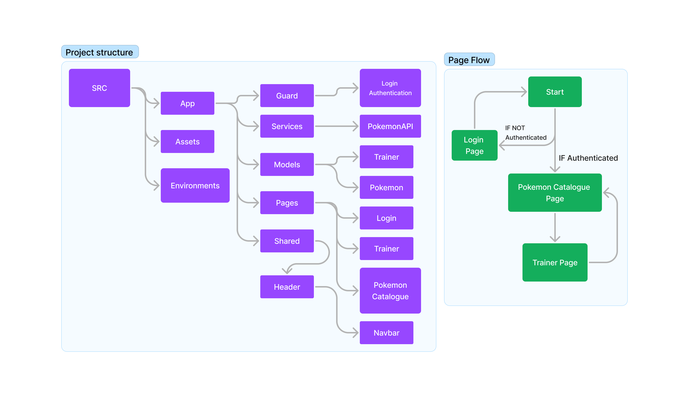

    <h1>Noroff Frontend Assignment 3: Pokémon Trainer</h1>
     

## Background information
The purpose of this project is to build a Pokémon Trainer webpage with Angular!

## Visit deployed page

This project has been deployed with [Netlify](https://www.netlify.com/). Webpage link:

    https://assignment-6-pokemon-puce.vercel.app/

## Maintainers

[@Andreas Nes](https://gitlab.com/andreas_nes_experis) 
[@Richard Stølen](https://gitlab.com/richardstolen)

## Contributing

PRs accepted.

Small note: If editing the Readme, please conform to the [standard-readme](https://github.com/RichardLitt/standard-readme) specification.

## License

[MIT](../LICENSE) © Richard Stølen & Andreas Nes

## Component Tree / Page flow

